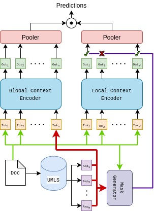

# interpretable-medical-text-classification
Contains the codebase for our paper **Developing Knowledge-aware Neural Models for Medical Forum Question Classification** that is submitted to the "Web Conference 2021".

### Setting up the environment
1. Mention the requirements.txt file and instructions to form the virtual environment

2. How to train and test the deep learning models. If possible, provide a table with results as well as total running time. Also mention the GPU architecture details.

### Running Bert-plus models

The code files in the form of self-contained Jupyter notebooks is available at: "src/ProposedKnowledgeAwareModel/"

### Experiments and Results
The BERT and MedBERT models were trained and evaluated on three datasets: CADEC, ICHI and OSHUMED( Datasets provided in the data directory). The accuracy scores of the baseline models and our proposed models on ICHI dataset were compared. The accuracy of the TextGCN model was 0.68 which was less than that of the BERT model(0.695) and the MedBERT model(0.706).  
Also various Interpretability analysis were run on the baseline Models. LIME and SHAP interpretability was used on Logistic Regression Models to find words which affect the outcomes. Similarly we used Hierarchical Attention Networks to extract the word and sentence attentions. These were used to show to what degree these models capture medical words.

