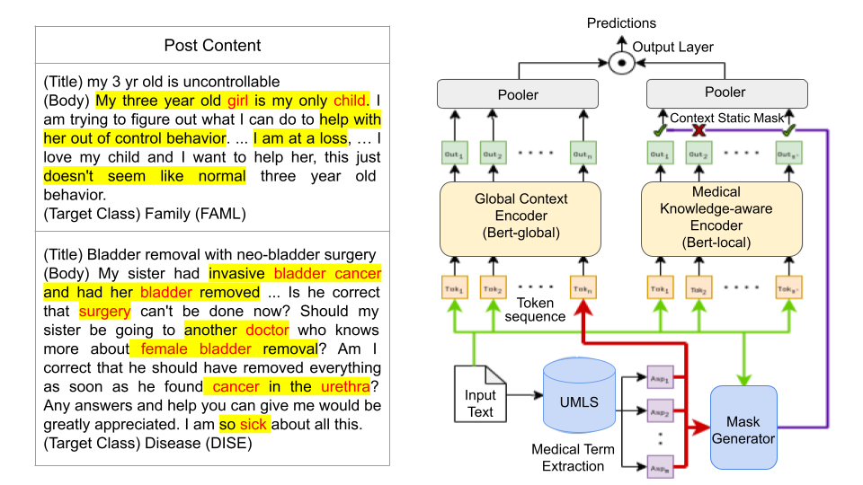

# knowledge-aware-med-classification
Contains the codebase for our paper **Knowledge-Aware Neural Networks for Medical Forum Question Classification** that is accepted for publication at the 30th ACM International Conference on Information and Knowledge Management [CIKM 2021](https://www.cikm2021.org/)

### Running Bert-plus models

The code files in the form of self-contained Jupyter notebooks is available at: **src/ProposedKnowledgeAwareModel/**

### Experiments and Results
The BERT and MedBERT models were trained and evaluated on three datasets: CADEC, ICHI and OSHUMED( Datasets provided in the data directory). The accuracy scores of the baseline models and our proposed models on ICHI dataset were compared. The accuracy of the TextGCN model was 0.68 which was less than that of the BERT model(0.695) and the MedBERT model(0.706).  
Also various Interpretability analysis were run on the baseline Models. LIME and SHAP interpretability was used on Logistic Regression Models to find words which affect the outcomes. Similarly we used Hierarchical Attention Networks to extract the word and sentence attentions. These were used to show to what degree these models capture medical words.

### Annotated CADEC dataset
We annotate CADEC as a multi-label multi-class dataset, for the task of "Medical Forum Question Classification". Each data point is annotated by 0 and 1, across five information need categories. We also have an additional column, containing the extracted medical concepts using QuickUMLS tool. The annotated files can be found at **CADEC-Annotations/**

