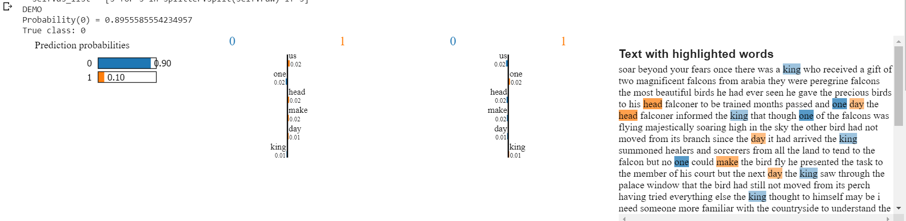

## Codes

This directory contains all the code files. The LIME and SHAP exists as a large set of screenshots. A sample like this - 

### Directory Structure

The directory structure is as follows:
* Text Classification: This directory consists of the codes used for Medical Text Classification. They were trained using the train set and evaluated using the test set provided in the data directory. It is splitted into the following three directories for comfort in understanding the usage of the codes:
  * BERT Models: It consists the codes of BERT, BERT plus Med and the McNemar's test on the BERT model.
  * Baseline Models: It consists the codes for basic Machine Learning Models and Heirarchical Attention Network. The Machine Learning Models used were Naive Bayes, Support Vector Machine and Logistic Regression. For taking care of the imbalance in the datasets we used SMOTE. The Hierarchichal Attention network was used for extracting the Word and Sentence Attentions of various datapoints.
  * Interpretability Analysis
* Adversarial ICHI: This directory consists of the code used for doing Semantically Equivalent Adversarial Attacks on ICHI Dataset. The dataset used in the same is provided under the data directory
* Adversarial Oshumed: This directory consists of the code used for doing Semantically Equivalent Adversarial Attacks on OSHUMED Dataset. The dataset used in the same is provided under the data directory
* Test_train_split/Oshumed: This consists of the code used for extracting the OSHUMED Data provided in the TextGCN paper and compile it into tsv files.
